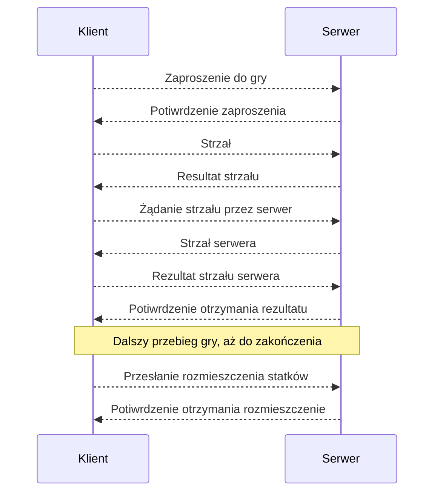

# Battleship
***
*Work in progress*
***
## Zasady gry

**Plansza**

Każdy z graczy posiada po dwie plansze o wielkości 10x10 pól. Pola oznaczone są poprzez współrzędne literami od A do J (wiersz) i liczbami 1 do 10 (kolumna). Na jednym z kwadratów gracz zaznacza swoje statki, których położenie będzie odgadywał przeciwnik. Na drugim zaznacza trafione statki przeciwnika i oddane przez siebie strzały.

**Flota**

Statki ustawiane są w pionie lub poziomie, w taki sposób, aby nie stykały się one ze sobą ani bokami, ani rogami. Gracze mogą posiadać po jednym czteromasztowcu wielkości czterech kratek, dwóch trójmasztowcach wielkości trzech kratek, trzech dwumasztowcach o wielkości dwóch kratek i po czterech jednomasztowcach.

```
  1 2 3 4 5 6 7 8 9 10
A ~ ~ O O O O ~ O ~ ~
B ~ ~ ~ ~ ~ ~ ~ ~ ~ ~
C ~ ~ O ~ ~ ~ ~ ~ ~ ~
D O ~ ~ ~ ~ ~ O ~ ~ ~
E ~ ~ ~ ~ ~ ~ O ~ ~ ~
F ~ ~ ~ ~ O ~ ~ ~ ~ ~
G O ~ ~ ~ O ~ O O O ~
H ~ ~ ~ ~ ~ ~ ~ ~ ~ ~
I ~ O O O ~ O ~ ~ ~ ~
J ~ ~ ~ ~ ~ O ~ ~ ~ ~
```
**Przebieg gry**

Zawsze zaczyna "Klient". Trafienie okrętu przeciwnika polega na strzale, który jest odgadnięciem położenia jakiegoś statku. Strzały oddawane są naprzemiennie, poprzez podanie współrzędnych pola (np. B5). W przypadku strzału trafionego, gracz kontynuuje strzelanie (czyli swój ruch) aż do momentu chybienia. Zatopienie statku ma miejsce wówczas, gdy gracz odgadnie położenie całego statku. O chybieniu gracz informuje przeciwnika słowem „pudło”, o trafieniu „trafiony” lub „(trafiony) zatopiony”.
Wygrywa ten, kto pierwszy zatopi wszystkie statki przeciwnika.


## Protokół

Protokół powinien być przesłany jako ciąg znaków, jedna linia.
### Możliwe wiadomości wysyłane przez klienta

**Zaproszenie do gry:**
```json
{
  "type":"GAME_INVITATION",
  "body":null
}
```
Odpowiedź serwera:
```json
{
  "type":"GAME_INVITATION",
  "status":0,
  "message": null,
  "body":null
}
```
lub
```json
{
  "type":"GAME_INVITATION",
  "status":1,
  "message": "Server is playing the other game.",
  "body":null
}
```
**Strzał:**
```json
{
  "type":"SHOT",
  "body":{
    "row":"A",
    "column":2
  }
}
```
Odpowiedź serwera:
```json
{
  "type":"SHOT",
  "status":0,
  "message": null,
  "body":"HIT"
}


```
lub
```json
{
  "type":"SHOT",
  "status":0,
  "message": null,
  "body":"MISS"
}
```
lub
```json
{
  "type":"SHOT",
  "status":0,
  "message": null,
  "body":"SINKING"
}
```
lub
```json
{
  "type":"SHOT",
  "status":2,
  "message": "The shot is not within the boundaries of the board.",
  "body":null
}
```
Możliwe odpowiedzi dla poprawnego zapytania:

- `MISS` oznacza pudło, czyli żaden statek nie został trafiony
- `HIT` oznacza trafienie, ale statek nie został zatopiony
- `SINKING` oznacza trafienie i zatopienie statku

**Żądanie strzału:**
```json
{
  "type":"SHOT_REQUEST",
  "body":null
}
```
Odpowiedź serwera:
```json
{
  "type":"SHOT_REQUEST",
  "status":0,
  "message": null,
  "body":{
    "row":"A",
    "column":2
  }
}
```
**Odpowiedź na strzał serwera:**
```json
{
  "type":"RESULT",
  "body":"HIT"
}
```
lub
```json
{
  "type":"RESULT",
  "body":"MISS"
}
```
lub
```json
{
  "type":"RESULT",
  "body":"SINKING"
}
```
Odpowiedź serwera:
```json
{
  "type":"RESULT",
  "status":0,
  "message": null,
  "body":null
}
```
**Przesłanie układu statków po skończonej grze:**
```json
{
  "type":"BOARD",
  "body":{
    "four":"B3-B6",
    "three":["E10-G10", "F3-H3"],
    "two":["A9-B9", "D7-D8", "I6-I7"],
    "one":["D2", "D5", "F7", "I9"]
    }
}
```
Odpowiedź serwera:
```json
{
  "type":"BOARD",
  "status":0,
  "message": null,
  "body":null
}
```
**Serwer nie rozpoznaje typu żądania:**

```json
{
  "type":"UNKNOWN",
  "status":4,
  "message": null,
  "body":null
}
```
>Wiadomości w odpowiedziach serwera mogą się różnić w zależności od przypadku i implementacji.


### Kody błędów

- `0 - OK` wszystko w porządku 
- `1 - SERVER_BUSY` serwer jest zajęty, ponieważ gra w inną grę 
- `2 - ILLEGAL_ARGUMENTS` przesłano do serwera nieprawidłowe dane
- `3 - INTERNAL_ERROR` wewnętrzny błąd serwera, gra zostaje przerwana
- `4 - BAD_REQUEST` serwer nie potrafi rozpoznać żądania


## Przykładowy diagram rozgrywki

